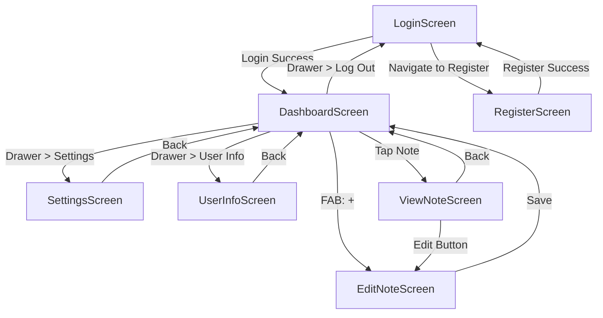

# Stiknes  

**Cloud-based note-taking app with Markdown support**  

Simple and fast note management with **Markdown** formatting and access from any device.  

## Features  
- Dark mode / Light mode  
- **Markdown** editing (headings, lists, code, *emphasis*, etc.)  
- Cloud synchronization (Supabase)  
- Responsive design (works on desktop and mobile)  

## Tech Stack  

### Desktop / Mobile  
- Flutter  
- Supabase  

### Web  
- Express.js 
- React
- Vite
- Supabase
- Prisma

## Installation  

Clone the repository and open Folder depending on witch version of app do you want to use

### Mobile / Desktop  
1. Install **Flutter**  
2. Create a database project in **Supabase**  
3. Add API key and API URL to the `.env` file  
4. Install dependencies with:  
   ```sh
   flutter pub get
   ```  
### Web
- Backend
  1. Add API for a direct connection to the database in `.env` file
  2. Create a database project in **Supabase**
  3. run `npx prisma migrate dev --name`
  4. Run `index.js`
- Frontend
  1. Add API key and API URL to the `.env` file
  2. Run the app

## Database Structure  

### `users` Table
```sql
CREATE TABLE public.user (
  id integer GENERATED ALWAYS AS IDENTITY NOT NULL,
  created_at timestamp with time zone NOT NULL DEFAULT now(),
  email text NOT NULL UNIQUE,
  username text,
  password text,
  updated_at timestamp without time zone,
  CONSTRAINT user_pkey PRIMARY KEY (id)
);
```

### `notes` Table
```sql
CREATE TABLE public.notes (
  id integer GENERATED ALWAYS AS IDENTITY NOT NULL,
  created_at timestamp with time zone NOT NULL DEFAULT now(),
  user_id integer NOT NULL,
  title text NOT NULL,
  content text,
  updated_at timestamp without time zone,
  CONSTRAINT notes_pkey PRIMARY KEY (id),
  CONSTRAINT notes_user_id_fkey FOREIGN KEY (user_id) REFERENCES public.user(id)
);
```


## App navigation



## API Routing Table

| Method | Endpoint                | Description                          | Parameters/Body                                                                 |
|--------|-------------------------|--------------------------------------|---------------------------------------------------------------------------------|
| GET    | `/api/health`           | Health check                         | -                                                                               |
| GET    | `/api/users`            | Get all users (paginated)            | Query: `page`, `limit`                                                          |
| GET    | `/api/users/:id`        | Get user by ID                       | URL Param: `id`                                                                 |
| POST   | `/api/users`            | Create new user                      | Body: `email`, `password` (min 6), `username` (optional)                        |
| PUT    | `/api/users/:id`        | Update user                          | URL Param: `id`<br>Body: `email` (opt), `password` (opt, min 6), `username` (opt) |
| DELETE | `/api/users/:id`        | Delete user                          | URL Param: `id`                                                                 |
| GET    | `/api/notes`            | Get all notes (paginated)            | Query: `page`, `limit`, `userId` (optional filter)                              |
| GET    | `/api/notes/:id`        | Get note by ID                       | URL Param: `id`                                                                 |
| POST   | `/api/notes`            | Create new note                      | Body: `title`, `userId` (required), `content` (optional)                        |
| PUT    | `/api/notes/:id`        | Update note                          | URL Param: `id`<br>Body: `title` (opt), `content` (opt), `userId` (opt)          |
| DELETE | `/api/notes/:id`        | Delete note                          | URL Param: `id`                                                                 |

## Notes on Parameters:
- `:id` parameters accept integers (converted to BigInt for users)
- All IDs in responses are returned as strings
- Pagination defaults: `page=1`, `limit=10`
- Dates are in ISO 8601 format

## Tests
- Flutter
  
   
   #### I have only tested method since i dont have enough will power to mock supabase in flutter
- Api
  
   
- React
   #### I dont have time and enough will power to mock supabase in react
  
## Authors  
- Filip Buszewicz  
- Kacper Czerwiński
  #### The involvement can be seen in the commit history

